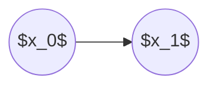

# Basics

## Encode

```mermaid
graph LR;
  x0(($x_0$))-->x1(($x_1$))
```

  message $x$ of length k
  +--------------------------+   &emsp;        encode
  |---------------------------| ------------->
  +-------------------------+
